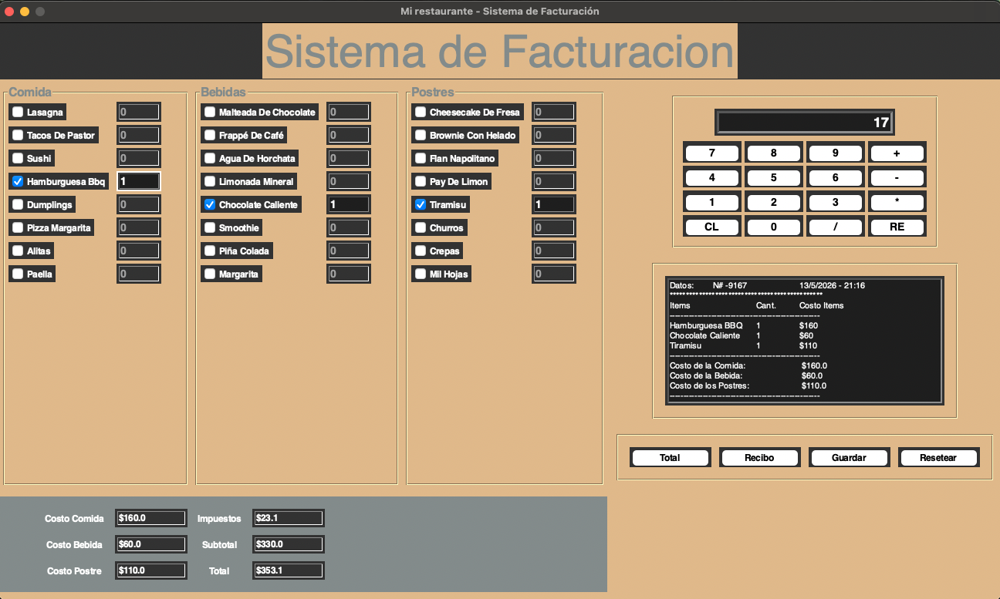
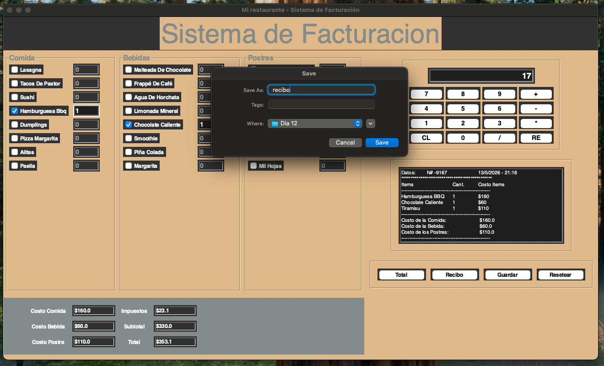
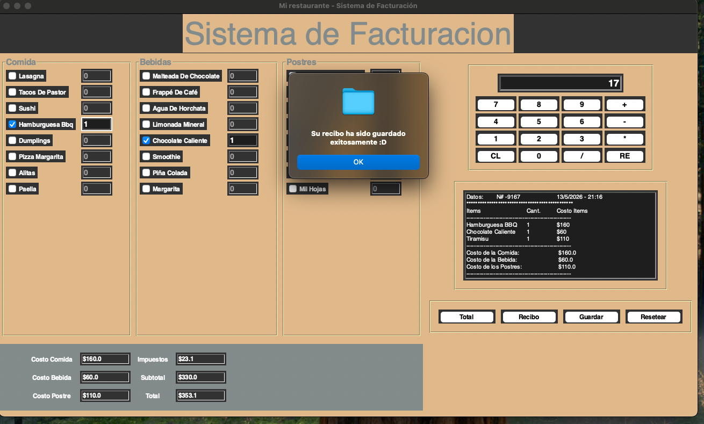
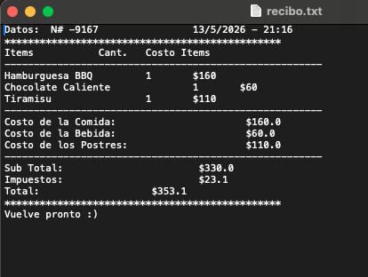

# 🍽️ Sistema de Facturación para Restaurante | Python + Tkinter

Aplicación de escritorio desarrollada en Python utilizando Tkinter, diseñada para simular un sistema de facturación de restaurante.

El sistema permite seleccionar alimentos, bebidas y postres mediante una interfaz gráfica interactiva, calcular costos automáticamente, generar recibos dinámicos y guardar tickets en archivos `.txt`.

---

# ✨ Características

✅ Interfaz gráfica desarrollada con Tkinter  
✅ Selección de productos mediante CheckButtons  
✅ Cálculo automático de subtotales, impuestos y total  
✅ Generación dinámica de recibos  
✅ Folios aleatorios para tickets  
✅ Fecha y hora automática en cada recibo  
✅ Guardado de recibos en archivos `.txt`  
✅ Sistema de reseteo completo  
✅ Calculadora integrada  
✅ Organización visual mediante Frames y LabelFrames  

---

# 🖼️ Vista General del Sistema

El sistema cuenta con:

- Panel de comidas
- Panel de bebidas
- Panel de postres
- Área de recibo
- Calculadora integrada
- Panel de costos
- Botones de control

---

# 🛠️ Tecnologías Utilizadas

- Python
- Tkinter
- Random
- Datetime

---

# 📌 Funcionalidades Principales

## 🧾 Generación de Recibos

El sistema genera tickets automáticamente mostrando:

- Productos seleccionados
- Cantidades
- Costos individuales
- Subtotales
- Impuestos
- Total final
- Fecha y hora
- Número de recibo aleatorio

---

## 🧮 Calculadora Integrada

Incluye una calculadora funcional desarrollada completamente con Tkinter.

### Operaciones soportadas:

- Suma
- Resta
- Multiplicación
- División

---

## 💾 Guardado de Tickets

Los recibos pueden guardarse como archivos `.txt` utilizando un cuadro de diálogo para seleccionar la ubicación.

---

## 🔄 Sistema de Reinicio

La aplicación puede resetear completamente:

- Checkboxes
- Cantidades
- Costos
- Recibos
- Estados de widgets

---

# 📂 Estructura General del Proyecto

```bash
📁 sistema-facturacion
 ┣ 📄 prueba_dos.py
 ┣ 📄 pruebas.py
 ┣ 📄 README.md
```

--- 

# ⚠️ Versiones Incluidas en el Proyecto

Este proyecto incluye dos versiones diferentes del sistema de facturación:

## 📄 `pruebas.py`
Primera versión del sistema.

- Contiene la estructura principal del proyecto.
- Algunas dimensiones de la interfaz aún no estaban completamente ajustadas.
- Debido al tamaño de la ventana, algunos botones y parte de la calculadora no alcanzan a visualizarse correctamente.

---

## ✅ `prueba_dos.py`
Versión corregida y recomendada del sistema.

- Se ajustaron las dimensiones de la ventana y los paneles.
- Todos los botones ya son visibles correctamente.
- La calculadora puede visualizarse completa.
- Presenta una mejor distribución visual de los elementos de la interfaz.

👉 Se recomienda ejecutar esta versión:

```bash
python prueba_dos.py
```

# ▶️ Cómo Ejecutar el Proyecto

## 1️⃣ Clona el repositorio

```bash
git clone https://github.com/tu-usuario/sistema-facturacion.git
```

## 2️⃣ Entra a la carpeta del proyecto

```bash
cd sistema-facturacion
```

## 3️⃣ Ejecuta el archivo principal

```bash
python main.py
```

---

# 🎯 Objetivo del Proyecto

Este proyecto fue desarrollado con fines educativos para practicar:

- Programación en Python
- Interfaces gráficas con Tkinter
- Manejo de eventos
- Uso de funciones
- Manipulación de widgets
- Generación dinámica de contenido
- Organización de interfaces GUI

---

# 📸 Capturas del Proyecto



 





---

# 👩‍💻 Autor

Desarrollado por Eve 💫

---

# ⭐ Extras

Este proyecto simula el comportamiento básico de un sistema POS (Point of Sale) utilizado en restaurantes o pequeños negocios.
